# 🧺 Electrolux OCP for Home Assistant

### Electrolux & AEG appliances via the official OCP Developer API.

Bringt deine **Electrolux-/AEG-Geräte** über die **offizielle OCP Developer-API** ([developer.electrolux.one](https://developer.electrolux.one)) in Home Assistant — mit **API Key + Access Token + Refresh Token**.
*Fokus Geschirrspüler, generisch für weitere Geräte. Kein Reverse-Engineering, keine App-Zugangsdaten.*

---

> [!WARNING]
> **🚧 BETA / experimentell.** Der Auth-/API-Flow ist gegen quelloffene Referenz-Clients belegt, aber einige gerätespezifische Feld- und Enum-Details sind im Code als `# VERIFY` markiert und **noch nicht gegen echte Hardware geprüft**. Bis dahin gilt: funktioniert grundsätzlich, kann aber je Gerät ungenaue Namen/Einheiten haben. [Diagnose-Export](#️-fehlerbehebung) hilft beim Verifizieren.

## 🧭 Was ist das?

Electrolux und AEG bieten für ihre vernetzten Geräte eine **offizielle Entwickler-API** an ([developer.electrolux.one](https://developer.electrolux.one)). Diese Integration nutzt genau diesen dokumentierten Weg — mit einem selbst erzeugten **API Key** sowie **Access-/Refresh-Token** — und bringt Zustand und Steuerung deiner Geräte in Home Assistant.

**Mehrbenutzer & generisch:** Jede:r trägt die **eigenen** Zugangsdaten ein (keine hartkodierten Werte, keine geteilten Credentials), mehrere Konten parallel möglich. Entitäten werden **dynamisch** aus den gemeldeten Geräte-Eigenschaften erzeugt — daher funktioniert die Integration über den Geschirrspüler-Fokus hinaus auch für Waschmaschinen, Trockner, Luftreiniger, Klimageräte und mehr.

## 🏗️ Wie es funktioniert

```mermaid
flowchart LR
  A["developer.electrolux.one<br/>API Key + Access + Refresh Token"] -->|Auto-Refresh| B[Electrolux OCP Coordinator]
  B -->|GET /appliances/&#123;id&#125;/state<br/>cloud polling| C["Sensoren / Binary-Sensoren"]
  B --> D["Select / Switch"]
  D -->|PUT /appliances/&#123;id&#125;/command| A
  C --> E[Dashboards & Automationen]
  D --> E
```

- **Coordinator** — ein gemeinsamer Poller hält alle Entitäten synchron und übersteht Ausfälle.
- **Token-Refresh** — der kurzlebige Access-Token wird automatisch über Refresh-Token + API Key erneuert; der rotierte Refresh-Token wird persistiert. Bei Ablauf startet HA automatisch einen **Reauth-Dialog**.
- **Entitäten** — lesende `sensor` / `binary_sensor` (Zustand, Programm, Phase, Restlaufzeit, Tür, Salz-/Klarspüler, Konnektivität) und schreibende `select` / `switch` (soweit die API Kommandos erlaubt).

## ✨ Features

- ☁️ **Offizielle OCP Developer-API** — sauber dokumentierter Weg, kein App-Reverse-Engineering.
- 🔁 **Automatischer Token-Refresh** + 🔐 **Reauth-Flow**.
- 👥 **Mehrbenutzer/generisch** — eigene Credentials, mehrere Konten, dynamische Entitäten.
- 🍽️ **Geschirrspüler-Fokus** — Zustand, Programm, Phase, Restlaufzeit, Tür, Salz-/Klarspüler-Warnung.
- 🎛️ **Lesen & Steuern** — `sensor`/`binary_sensor` + `select`/`switch`.
- 🩺 **Diagnose mit redigierten Secrets** — Tokens/Seriennummern/PII werden automatisch entfernt.
- 🌍 **Mehrsprachig** — Deutsch (Du) & Englisch.

## 📦 Installation

### Via HACS (empfohlen)

1. **HACS → Drei-Punkte-Menü → Custom repositories**.
2. URL `https://github.com/forseti1982/HA-Electrolux-ocp`, Kategorie **Integration**, hinzufügen.
3. In HACS **„Electrolux OCP"** suchen und installieren.
4. Home Assistant **neu starten**.

### Manuell

Ordner `custom_components/electrolux_ocp` nach `config/custom_components/` kopieren und HA neu starten.

## ⚙️ Einrichtung

1. Auf [developer.electrolux.one](https://developer.electrolux.one) mit dem **gleichen Konto** wie in der Electrolux-/AEG-App anmelden.
2. Im [Dashboard](https://developer.electrolux.one/dashboard) einen **API Key** erstellen sowie **Access Token** und **Refresh Token** erzeugen.
3. In HA: **Einstellungen → Geräte & Dienste → Integration hinzufügen → „Electrolux OCP"**, dann alle **drei** Werte eintragen.
4. Optional: **Abfrage-Intervall** in den Optionen anpassen (Default 60 s; die API ist rate-limitiert, ≥ 120 s empfohlen).

## ✅ Unterstützt

| Bereich | Status |
|---|---|
| Auth-Flow (API Key + Access + Refresh, Auto-Refresh, Reauth) | ✅ gegen Referenz-Clients belegt |
| Geschirrspüler (Zustand/Programm/Phase/Restzeit/Tür/Salz/Klarspüler) | 🟠 Fokus — Feldnamen `# VERIFY`, an echter Hardware zu prüfen |
| Waschmaschine / Trockner / Luftreiniger / Klima | 🟠 generisch abgedeckt, community-verifiziert |
| Schreibende Kommandos (`select`/`switch`) | 🟠 experimentell, `# VERIFY` |

## ⚠️ Disclaimer

Inoffizielles Community-Projekt. Steht in **keiner** Verbindung zur Electrolux Group und wird von ihr weder unterstützt noch geprüft. „Electrolux" und „AEG" sind Marken ihrer jeweiligen Eigentümer. Nutzung auf eigene Verantwortung, ohne Gewähr.

## 🛠️ Fehlerbehebung

- **403 / 401:** API Key und Tokens prüfen (Tippfehler/Leerzeichen). Access Token ist kurzlebig — bei anhaltendem Fehler frische Tokens im [Dashboard](https://developer.electrolux.one/dashboard) erzeugen; HA startet bei Ablauf automatisch den Reauth-Dialog. Sicherstellen, dass das **gleiche Konto** wie in der App genutzt wird; bei hartnäckigem 403 einmal auf der regionalen Electrolux-/AEG-Website einloggen.
- **429 (Rate-Limit):** Poll-Intervall in den Optionen erhöhen (≥ 120 s).
- **Falsche/fehlende Werte:** Diagnose-Export erstellen (Gerät → drei Punkte → **„Diagnosen herunterladen"**; Secrets sind darin **redigiert**) und einem Issue anhängen — so lassen sich die `# VERIFY`-Punkte für dein Gerät schließen.

> 🔐 **Sicherheit:** API Key und Tokens geheim halten — niemals in Issues, Logs oder Screenshots einfügen. Dieses Repo enthält **keine** echten Zugangsdaten (nur Platzhalter).
